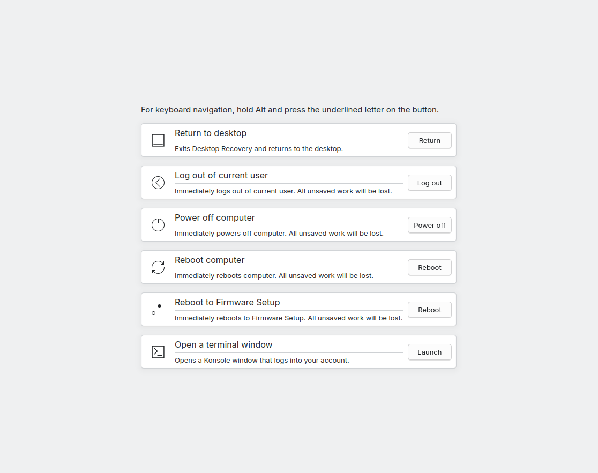

# Atychia

A utility akin to Ctrl-Alt-Delete on Windows that allows a user to recover from a broken session, rather than being forced to a TTY.
This automatically registers a shortcut with KDE, and is designed for use with KDE. Registers `Meta+Ctrl+Alt+Del` by default.

Attempts to look a bit like the Plymouth boot screen - you'll find that it takes the watermark from the spinner theme, and has a black background for consistency.



Requires an up to date version of KDE Frameworks 6, Qt 6, systemd, logind, and Polkit.

## Build and installation

Dependencies can be installed with:
```
sudo dnf install rpmspec ninja-build clang
sudo dnf builddep ./filotimo-atychia.spec
sudo dnf install $(rpmspec -q --requires ./filotimo-atychia.spec | xargs)
```

You can build and install this with the following:
```
cmake -B build/ -DCMAKE_INSTALL_PREFIX=/usr && cmake --build build/ -v && sudo cmake --install build/
```

or, if you have a KDE development environment set up that you can log in to the session for:
```
cmake -B build/ -DCMAKE_INSTALL_PREFIX=~/kde/usr && cmake --build build/ -v && cmake --install build/
```
