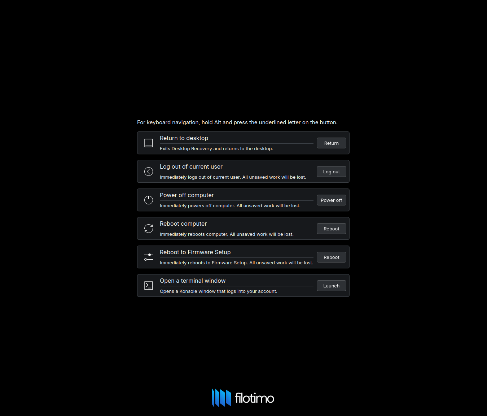

# Atychia

A utility akin to Ctrl-Alt-Delete on Windows that allows a user to recover from a broken session, rather than being forced to a TTY.
This automatically registers a shortcut with KDE, and is designed for use with KDE. Registers `Meta+Ctrl+Alt+Del` by default.
A shortcut is also registered to relaunch Plasmashell - `Meta+Ctrl+Shift+B`.




Requires a system user `atychia` (UID below 1000, and no home dir) which is in the `atychia` and `video` group.
You can make this with `sudo useradd -r atychia && sudo usermod -a -G video atychia`.
Requires an up to date version of KDE Frameworks 6, Qt 6, systemd, logind, and Polkit.
Also requires `cage`, the Wayland kiosk compositor, to be installed.

You can build and install this with the following:
```
mkdir -p build && cd build
sudo cmake .. -G "Kate - Ninja" -DCMAKE_EXPORT_COMPILE_COMMANDS=ON
sudo ninja-build -C . install
```

## TODO
- Proper integrated i18n, automated within GitHub Actions. I don't know how to do this but it would be good to have this consistent across all upcoming Filotimo applications.
- TUI launched in the event that a Wayland session can't be run - this also requires some way to get to Atychia from a TTY (libevdev daemon?)
